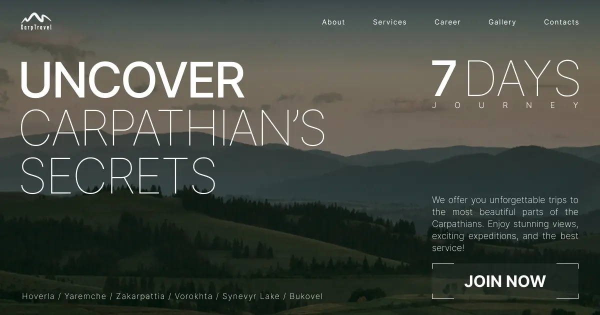
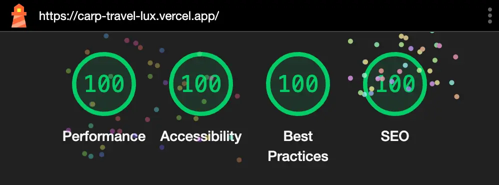

## CarpTravel

CarpTravel offers unique and unforgettable journeys through the picturesque Carpathian Mountains, including encompassing sightseeing excursions and top-notch service. The enthusiastic team strives to immerse tourists in the magical atmosphere of the mountains, providing a deep connection with nature and an opportunity to unlock their own potential. Tourists can choose from a variety of outdoor activities proven over time by the experience and expertise of their professional guides.



## Installation

1. Clone the repository:

   ```bash
   git clone https://github.com/Aleksandr2905/carp-travel.git

   cd carp-travel
   ```

2. Install the dependencies:

   ```bash
   npm install
   ```

   or

   ```bash
   yarn install
   ```

3. Running the Application
   After installing the dependencies, you can run the application locally:

   ```bash
   npm run dev
   ```

   or

   ```bash
   yarn dev
   ```

Your application will be available at http://localhost:3000.

## Main Technologies

1. Next.js:
   Version: 14.2.5
   A React framework enabling server-side rendering, static site generation, and API routes.

2. React:
   Version: 18
   A JavaScript library for building user interfaces, used as the foundation for the project.

3. TypeScript:
   Version: 5
   A superset of JavaScript that includes static typing, enhancing code quality and maintainability.

4. Tailwind CSS:
   Version: 3.4.6
   A utility-first CSS framework for styling the application, promoting rapid UI development.

5. Form Handling:
   react-hook-form: Version 7.52.1
   A library for managing form state and validation in React applications.
   @hookform/resolvers: Version 3.9.0
   Provides resolvers for integrating third-party validation libraries like Yup.

6. Validation:
   Yup: Version 1.4.0
   A JavaScript schema builder for value parsing and validation used in conjunction with react-hook-form.

7. ESLint and Prettier:
   eslint: Version 8
   A linter for identifying and fixing problems in JavaScript code.
   eslint-config-prettier: Version 9.1.0
   Disables ESLint rules that conflict with Prettier.
   prettier: Version 3.3.3
   A code formatter for keeping code style consistent.

8. Modal and Toast Notifications:
   react-hot-toast: Version 2.4.1
   A library for displaying toast notifications in a React application.

9. Responsive Design:
   react-responsive: Version 10.0.0
   A library for responsive design that enables components to adapt to different screen sizes.

10. Input Handling:
    react-input-mask: Version 2.0.4
    A library for creating input masks for better user input handling.

11. Scrolling Effects:
    react-scroll: Version 1.9.0
    A library for smooth scrolling in single-page applications.

12. Swiper:
    Version: 11.1.7
    A powerful library for creating modern, touch-friendly sliders.

## Summary

These technologies combined provide a solid foundation for building a modern web application, incorporating best practices for performance, scalability, and maintainability.


